# Теория: вейвлет-анализ и сжатие сигналов

## 1. Непрерывное вейвлет-преобразование (НВП / CWT)
Предназначено для частотно-временного анализа нестационарных сигналов. В отличие от оконного преобразования Фурье, использует переменное частотно-временное окно.

**Формула НВП:**
$$S(a, b) = \frac{1}{\sqrt{a}} \int_{-\infty}^{\infty} s(t) \cdot \psi\left(\frac{t-b}{a}\right) dt$$

*   $\psi(t)$ — материнская вейвлет-функция.
*   $b \in \mathbb{R}$ — параметр **сдвига** (локализация по времени).
*   $a \in \mathbb{R}^+$ — параметр **масштаба** (локализация по частоте). 
    *   $a > 1$: расширение вейвлета во времени, сужение спектра (анализ НЧ).
    *   $a < 1$: сужение вейвлета во времени, расширение спектра (анализ ВЧ).
*   **Условие допустимости (DC = 0):** $\int_{-\infty}^{\infty} \psi(t)dt = 0$.

## 2. Дискретизация параметров
Для устранения избыточности параметры масштаба и сдвига дискретизируются по диадической сетке:
*   $a = 2^m$, где $m \in \mathbb{Z}$ (октавный масштаб).
*   $b = n \cdot 2^m$, где $n \in \mathbb{Z}$ (шаг сдвига пропорционален ширине окна).

## 3. Связь непрерывного интеграла и дискретного базиса (КМА)
Непрерывное вейвлет-преобразование (НВП) обладает бесконечной избыточностью. Теория КМА доказывает, что если материнская вейвлет-функция $\psi(t)$ порождена из скейлинг-функции $\phi(t)$, то непрерывный интеграл достаточно вычислить только в узлах диадической сетки ($a = 2^m$, $b = n 2^m$).
Полученные дискретные вейвлет-коэффициенты:
$$d_{m,n} = \int_{-\infty}^{\infty} s(t) \cdot 2^{-m/2}\psi(2^{-m}t - n) dt$$
строго соответствуют проекциям сигнала на базисные векторы $\psi_{m,n}(t)$, которые образуют полный ортонормированный базис пространства $L_2(\mathbb{R})$. Это позволяет отказаться от интегрального исчисления в пользу дискретного.

## 4. Кратномасштабный анализ (КМА / MRA)
Теоретическая база для построения дискретного вейвлет-преобразования. Пространство всех сигналов $L_2(\mathbb{R})$ представляется как последовательность вложенных подпространств (уровней разрешения):
$$\dots \subset V_2 \subset V_1 \subset V_0 \subset V_{-1} \subset V_{-2} \dots$$

**Ключевые свойства КМА:**
1.  $\bigcap V_m = \{0\}$, $\bigcup V_m = L_2(\mathbb{R})$.
2.  **Масштабирование:** $s(t) \in V_m \iff s(2t) \in V_{m-1}$.
3.  Существует **скейлинг-функция** (масштабирующая функция) $\phi(t)$, целочисленные сдвиги которой $\{\phi(t-n)\}$ образуют ортонормированный базис пространства $V_0$.

**Масштабирующее уравнение:**
Так как $V_0 \subset V_{-1}$, функция $\phi(t)$ раскладывается по базису пространства $V_{-1}$:
$$\phi(t) = \sqrt{2} \sum_n h_n \cdot \phi(2t - n)$$
*   $h_n$ — коэффициенты дискретного фильтра нижних частот (ФНЧ).

## 5. Вейвлет-функция и пространство деталей
Переход от более точного пространства $V_{m-1}$ к более грубому $V_m$ описывается через ортогональное дополнение $W_m$:
$$V_{m-1} = V_m \oplus W_m$$
*   $V_m$ — пространство аппроксимации (сглаженный сигнал).
*   $W_m$ — пространство деталей (ошибка аппроксимации, высокочастотные компоненты).

Базисом для подпространства $W_0$ служат сдвиги **вейвлет-функции** $\psi(t)$. Так как $W_0 \subset V_{-1}$, выполняется **вейвлет-уравнение**:
$$\psi(t) = \sqrt{2} \sum_n g_n \cdot \phi(2t - n)$$
*   $g_n$ — коэффициенты дискретного фильтра высоких частот (ФВЧ).
*   Связь фильтров (для ортогональных базисов): $g_n = (-1)^n h_{-n+1}$.

## 6. Спектральное доказательство свойств фильтров $h_n$ и $g_n$
Частотные характеристики цифровых фильтров $h_n$ и $g_n$ определяются через свойства порождаемых ими непрерывных функций при переходе в область Фурье.

**Доказательство для $h_n$ (ФНЧ):**
Применение преобразования Фурье к масштабирующему уравнению дает:
$$\Phi(\omega) = H\left(\frac{\omega}{2}\right) \Phi\left(\frac{\omega}{2}\right)$$
где $H(\omega)$ — частотная характеристика фильтра $h_n$.
Скейлинг-функция $\phi(t)$ аппроксимирует сигнал, значит площадь под ней не равна нулю: $\int \phi(t)dt \neq 0 \implies \Phi(0) \neq 0$.
Подстановка $\omega = 0$ дает $\Phi(0) = H(0)\Phi(0)$, откуда **$H(0) = 1$**. 
Фильтр с единичным коэффициентом передачи на нулевой частоте является **фильтром нижних частот**.

**Доказательство для $g_n$ (ФВЧ):**
Уравнение для вейвлет-функции в частотной области:
$$\Psi(\omega) = G\left(\frac{\omega}{2}\right) \Phi\left(\frac{\omega}{2}\right)$$
где $G(\omega)$ — частотная характеристика фильтра $g_n$.
Вейвлет-функция не имеет постоянной составляющей: $\int \psi(t)dt = 0 \implies \Psi(0) = 0$.
Подстановка $\omega = 0$ дает $0 = G(0)\Phi(0)$, и так как $\Phi(0) \neq 0$, то **$G(0) = 0$**.
Фильтр с нулевым коэффициентом передачи на нулевой частоте является **фильтром высоких частот**.

## 7. Быстрое вейвлет-преобразование (Банки фильтров)
На практике интегралы заменяются цифровой фильтрацией дискретного сигнала (алгоритм Малла).

**Система анализа (Прямое преобразование):**
Сигнал $x(n)$ длины $N$ параллельно пропускается через два КИХ-фильтра с последующей **децимацией** (downsampling, $\downarrow 2$ — отбрасывание каждого второго отсчета):
1.  Свертка с ФНЧ ($H$) + $\downarrow 2 \rightarrow$ Коэффициенты аппроксимации (длина $N/2$).
2.  Свертка с ФВЧ ($G$) + $\downarrow 2 \rightarrow$ Вейвлет-коэффициенты деталей (длина $N/2$).

**Алгоритм одиночного дерева:**
Октавополосное разбиение спектра достигается путем рекурсивного применения пары фильтров ($H, G$) и децимации **только к НЧ-ветви** (аппроксимации) предыдущего уровня.

**Система синтеза (Обратное преобразование):**
1.  **Интерполяция** (upsampling, $\uparrow 2$): вставка нулей между отсчетами аппроксимации и деталей.
2.  Свертка с восстанавливающими фильтрами $\tilde{H}$ и $\tilde{G}$.
3.  Поэлементное суммирование результатов.

**Условие полного восстановления (Perfect Reconstruction):**
Децимация вносит искажения (aliasing). В системе КМА фильтры $H$ и $G$ проектируются как **квадратурно-зеркальные фильтры (КЗФ / QMF)**. При суммировании на этапе синтеза элайзинг из ветви ФНЧ строго компенсируется элайзингом из ветви ФВЧ, обеспечивая точное восстановление сигнала.

## 8. Математическое обоснование алгоритма Малла
Алгоритм цифровой фильтрации (Малла) есть дискретный эквивалент вычисления интегралов ортогональной проекции. 

**Прямое преобразование (Анализ):**
Пусть дискретный сигнал $c_0[n]$ — это проекции на исходный масштаб $V_0$. Проекции на более грубый масштаб $V_1$ ($c_1[k]$) и пространство деталей $W_1$ ($d_1[k]$) вычисляются подстановкой уравнений КМА в интеграл скалярного произведения:
$$c_1[k] = \sum_n h_{n-2k} \cdot c_0[n]$$
$$d_1[k] = \sum_n g_{n-2k} \cdot c_0[n]$$
*Дискретный смысл:* Данные формулы — это математическое определение операции **дискретной свертки** (умножение на $h_n$ / $g_n$ и суммирование) в сочетании с **децимацией в 2 раза**, так как сдвиг фильтра происходит с шагом $2k$, а не $k$.

**Обратное преобразование (Синтез):**
Поскольку пространство $V_0 = V_1 \oplus W_1$ (прямая ортогональная сумма), исходный сигнал строго восстанавливается сложением его проекций из этих подпространств. В дискретном виде это выражается формулой:
$$c_0[n] = \sum_k c_1[k] \cdot h_{n-2k} + \sum_k d_1[k] \cdot g_{n-2k}$$
*Дискретный смысл:* Индекс $n-2k$ математически описывает операцию **интерполяции нулевыми отсчетами (upsampling)** перед сверткой с восстанавливающими фильтрами. Точное восстановление (Perfect Reconstruction) гарантируется самой аксиоматикой ортогональности вложенных подпространств в КМА.

## 9. Применение в сжатии с потерями
1.  **Декомпозиция:** Сигнал подвергается многоуровневому дискретному вейвлет-преобразованию (ДВП).
2.  **Квантование:** Вейвлет-коэффициенты в подпространствах деталей ($W_m$) делятся на шаг квантования и округляются. Большинство высокочастотных коэффициентов обнуляется.
3.  **Энтропийное кодирование:** Образовавшиеся длинные последовательности нулей сжимаются без потерь (например, арифметическим кодером).

*Особенность:* В отличие от ДКП (JPEG), ДВП применяется ко всему сигналу целиком, что исключает появление артефактов блочности при высоких степенях сжатия.

# Практика. Применение вейвлет-разложения для фильтрации изображений.

Все эксперименты выполнены на Python с использованием библиотеки `PyWavelets (pywt)`. В качестве исходного изображения взята фотография, приведённая к размеру 512×512 пикселей в оттенках серого.

## 1. Вейвлет-разложение исходного изображения

Применим 2-уровневое разложение с вейвлетом Хаара к исходному изображению без шума.

На рисунке каждый уровень разложения отображается в виде трёх подполос:
- **cH** (горизонтальные) — выделяет горизонтальные границы объектов.
- **cV** (вертикальные) — выделяет вертикальные границы.
- **cD** (диагональные) — выделяет диагональные переходы.
- **cA** (аппроксимация) — размытая копия оригинала, содержащая только низкие частоты.

Видно, что большинство значимой информации сосредоточено в аппроксимации, а подполосы деталей в основном содержат нули.

## 2. Фильтрация белого гауссовского шума (AWGN)

К изображению добавляется белый гауссовский шум с тремя уровнями интенсивности, задаваемыми параметром $\sigma$:

| Уровень | $\sigma$ | RMSE зашумлённого |
|---|---|---|
| Низкий  | 10 | 9.8  |
| Средний | 20 | 19.8 |
| Высокий | 30 | 29.9 |

После добавления шума проводится 4-уровневое вейвлет-разложение (вейвлет Хаара). Затем к коэффициентам деталей применяется **жёсткая пороговая фильтрация**: все коэффициенты, абсолютное значение которых меньше порога $t$, обнуляются. Аппроксимация не трогается. После этого выполняется обратное преобразование.

Для оценки качества восстановления используется СКО (RMSE) между оригиналом и восстановленным изображением:
$$\text{RMSE} = \sqrt{\frac{1}{N}\sum_{i}(x_i - \hat{x}_i)^2}$$

---

### Низкий шум (σ = 10)

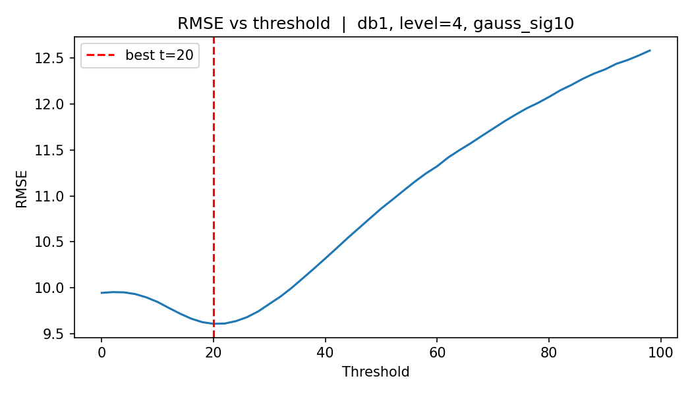

Оптимальный порог $t = 24$, RMSE после фильтрации = **7.6** (было 9.8).

Кривая имеет выраженный минимум при небольшом пороге. При $t = 0$ фильтрация отсутствует. С ростом порога шумовые коэффициенты обнуляются и RMSE быстро снижается. После минимума кривая плавно растёт: порог начинает срезать значимые коэффициенты сигнала, внося размытие.

| Зашумлённое (σ=10) | Лучший визуальный результат |
|:---:|:---:|
|  | |

---

### Средний шум (σ = 20)

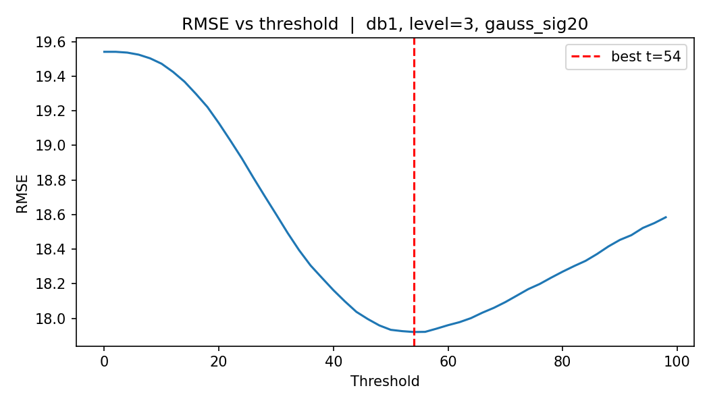

Оптимальный порог $t = 54$, RMSE после фильтрации = **17.9** (было 19.8).

Минимум смещается вправо: шумовые коэффициенты крупнее и требуют большего порога. Кривая более пологая вблизи минимума — оптимальный порог менее чувствителен к точной настройке.

| Зашумлённое (σ=20) | Лучший визуальный результат |
|:---:|:---:|
|  | |

---

### Высокий шум (σ = 30)

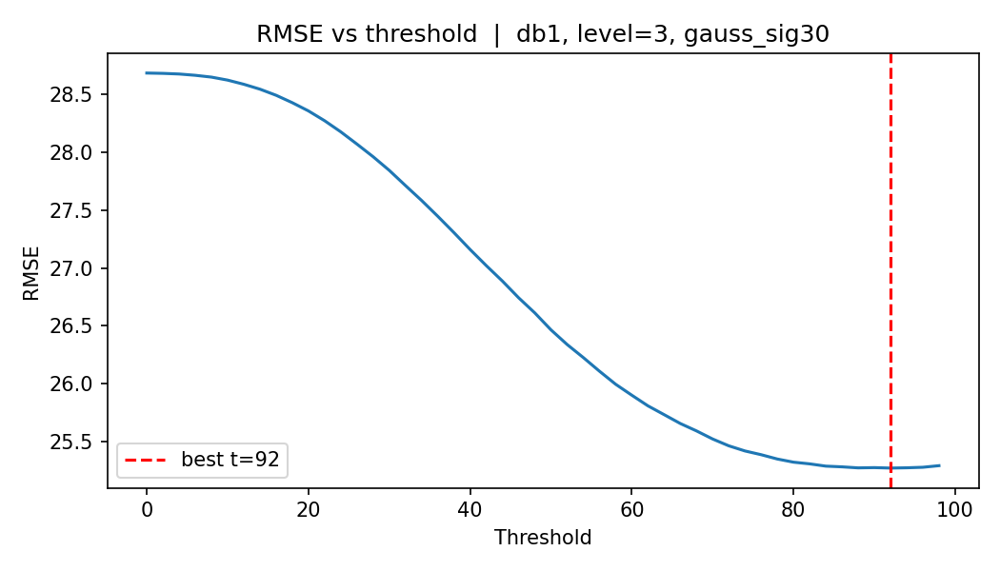

Оптимальный порог $t = 92$, RMSE после фильтрации = **25.3** (было 29.9).

Оптимум ушёл к самой границе диапазона. Кривая монотонно убывает на всём промежутке: шум настолько силён, что агрессивное обнуление деталей выгодно вплоть до максимального порога. Восстановленное изображение заметно размыто.

| Зашумлённое (σ=30) | Лучший визуальный результат |
|:---:|:---:|
| 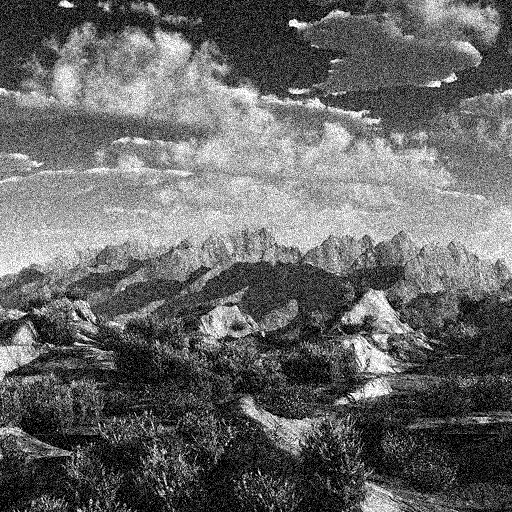 | |

---

### Общая закономерность для AWGN

Чем выше $\sigma$, тем правее оптимальный порог. Амплитуда шумовых коэффициентов в вейвлет-области пропорциональна $\sigma$, поэтому для их подавления нужен более высокий порог. При этом форма кривой меняется от выраженного U-образного минимума (слабый шум) до монотонно убывающей (сильный шум).

## 3. Фильтрация шума типа «соль и перец»

Шум «соль и перец» случайно устанавливает часть пикселей в 0 (перец) или 255 (соль). Мощность задаётся параметром `density` — долей испорченных пикселей:

| Уровень | density | % пикселей | RMSE зашумлённого |
|---|---|---|---|
| Низкий  | 0.02 | 2%  | 21.2 |
| Средний | 0.05 | 5%  | 33.4 |
| Высокий | 0.15 | 15% | 57.9 |

Пиксели соли и перца — это единичные выбросы с экстремальными значениями (0 и 255). Предполагается, что в вейвлет-области они дадут крупные по амплитуде коэффициенты, поскольку вейвлет-фильтр реагирует на резкие перепады яркости. Поэтому для их подавления применяется **обратная жёсткая пороговая фильтрация** (hard inverse): обнуляются коэффициенты, у которых $|x| > t$, то есть самые крупные выбросы. Это противоположно стандартному режиму для AWGN, где обнуляются малые коэффициенты ($|x| < t$).

Процедура: 4-уровневое разложение → обратная пороговая фильтрация cD → восстановление.

---

### Низкий шум (density = 0.02)

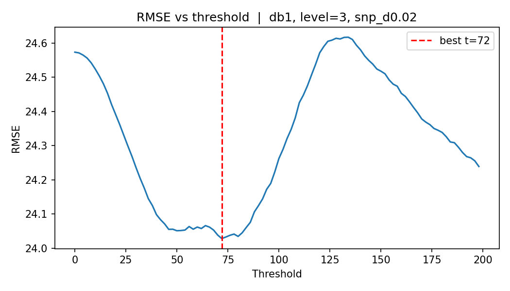

Лучший визуальный результат при $t = 72$, RMSE = **24.0** (было 21.2).

При малой плотности шума на графике можно заметить некоторый минимум RMSE, однако визуально при данном пороге фильтрации проявляются блочные артефакты, из-за которых изображение воспринимается даже хуже нефильтрованного.

| Зашумлённое (d=0.02) | Лучший визуальный результат |
|:---:|:---:|
|  |  |

---

### Средний шум (density = 0.05)

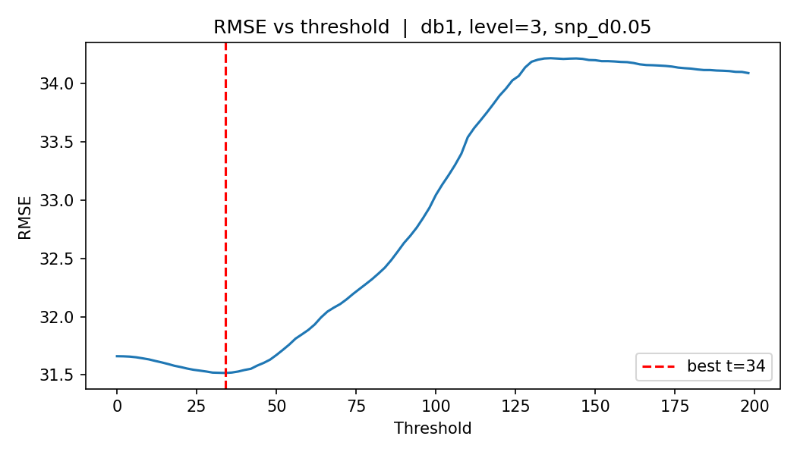

Лучший визуальный результат при $t = 34$, RMSE = **31.5** (было 33.4).

При средней плотности шума фильтрация даёт небольшое, улучшение RMSE. Однако опять же на восстановленном изображении появляются характерные блочные артефакты.

| Зашумлённое (d=0.05) | Лучший визуальный результат |
|:---:|:---:|
| 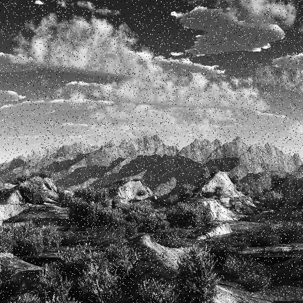 | 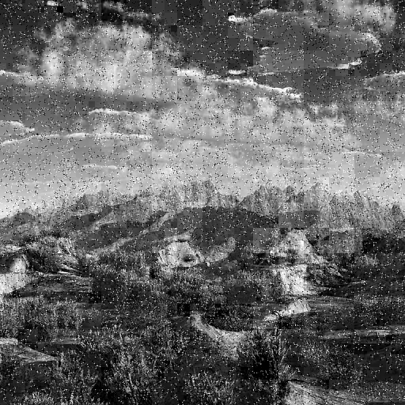 |

---

### Высокий шум (density = 0.15)

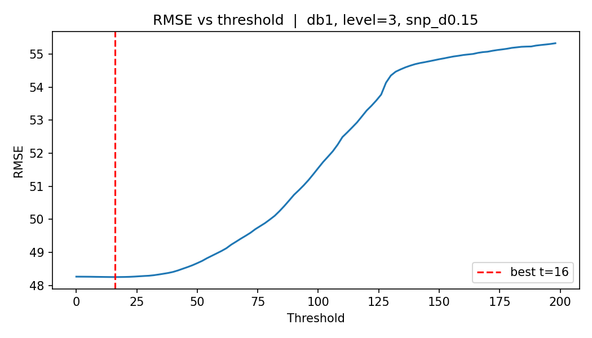

Лучший визуальный результат при $t = 16$, RMSE = **48.3** (было 57.9).

При высокой плотности шума обратная пороговая фильтрация даёт ощутимое снижение RMSE. Малый оптимальный порог объясняется тем, что из-за частого наложения выбросы создают целые кластеры крупных коэффициентов в cD, и для их устранения достаточно низкого порога. Блочные артефакты по-прежнему присутствуют на восстановленном изображении.

| Зашумлённое (d=0.15) | Лучший визуальный результат |
|:---:|:---:|
| 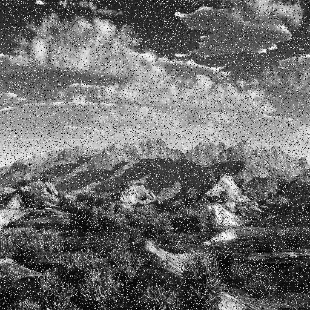 |  |

---

### Общая закономерность для «соль и перец»

Во всех случаях фильрация верхним порогом дает выйгрыш по RMSE, однако визуально только ухудшает восприятие изображения, из-за проявления блочных артефактов.

## 4. Анализ ограничений вейвлет-фильтрации для шума «соль и перец»

### 4.1 Визуализация разложения зашумлённого изображения

Для понимания причины неудачи было построено вейвлет-разложение зашумлённого изображения.

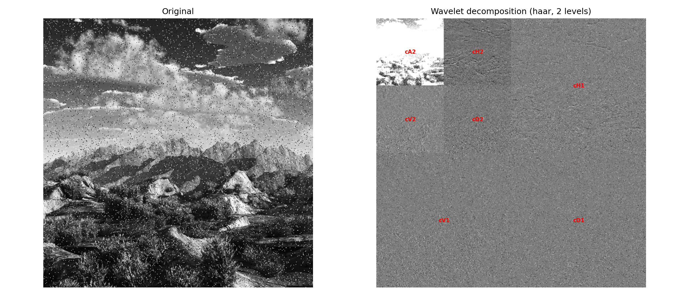

Ключевое наблюдение: **шум «соль и перец» проявляется во всех подполосах разложения**, включая аппроксимацию cA, а не только в диагональной cD.

### 4.3 Причина: импульсный шум имеет плоский спектр

Математически это объясняется свойством спектра идеального единичного импульса (дельта-функции):
$$\delta[n] \xrightarrow{\mathcal{F}} 1$$

Спектр идеального импульса равномерен по всем частотам. Пиксели соли и перца — это единичные изолированные выбросы, то есть импульсы в пространственной области. Банк фильтров вейвлета не разделяет их по подполосам, а распределяет их энергию **равномерно по всем уровням и ориентациям разложения**.

В результате диагональная подполоса cD после добавления соляно-перечного шума выглядит как **белый гауссовский шум** — статистически равномерные, небольшие по амплитуде коэффициенты. Крупных выбросов, характерных именно для cD, не возникает. Это и объясняет неработоспособность фильтрации по верхнему порогу только для cD.

### 4.4 Почему фильтрация ухудшает изображение

Обратная жёсткая пороговая фильтрация (обнуление $|x| > t$) в cD срезает **самые крупные коэффициенты** этой подполосы. Но крупные коэффициенты в cD — это не только шум: среди них — следы **резких диагональных перепадов** на оригинальном изображении (углы объектов, текстуры). Их обнуление вносит характерные артефакты — **заметные прямоугольные блоки** на изображении, обусловленные блочной природой вейвлет-разложения. При малой плотности шума исходный шум «соль и перец» визуально воспринимается мягче, чем эти блоки.

### 4.5 Вывод

Вейвлет-пороговая фильтрация эффективна для аддитивного шума с гауссовским распределением, поскольку такой шум создаёт **малые** коэффициенты, легко отделимые от **крупных** коэффициентов сигнала. Шум «соль и перец» нарушает это условие: его пространственная импульсность размазывает энергию по всем подполосам, лишая порог разделительной силы.

## 5. Влияние параметров разложения на качество фильтрации

### 5.1 Число уровней разложения

Было проверено изменение числа уровней разложения (от 2 до 4). Влияние на кривые RMSE оказалось незначительным для обоих типов шума. Это объясняется тем, что большинство шумовых и сигнальных коэффициентов сосредоточено на первых уровнях разложения (мелкие масштабы, ближайшие к исходному разрешению); глубокие уровни содержат лишь немного энергии и не меняют итоговый баланс.

### 5.2 Фильтрация только диагональной подполосы cD

В ходе работы был сделан выбор фильтровать **только диагональную подполосу cD**, оставляя горизонтальную cH и вертикальную cV без изменений. Это решение мотивировано стандартом JPEG2000, в котором диагональная подполоса считается наименее значимой и получает грубейший шаг квантования.

Практический эффект: при фильтрации гауссовского шума изменения RMSE заметно уменьшились по сравнению с фильтрацией всех трёх подполос. Причина очевидна — из рассмотрения исключены cH и cV, которые также несут шумовые коэффициенты. Тем не менее даже ограниченная фильтрация cD даёт снижение RMSE, поскольку диагональные коэффициенты вносят вклад в полную ошибку.

Вопрос о том, стоит ли фильтровать все три подполосы или только cD, зависит от задачи. В сжатии с потерями применяется квантование **всех** подполос; в задаче фильтрации шума оптимальнее фильтровать все высокочастотные подполосы одновременно.

## 6. Выводы

Дискретное вейвлет-преобразование в сочетании с жёстким порогом является эффективным инструментом подавления **аддитивного белого гауссовского шума**: оно компактно представляет сигнал в высокочастотных подполосах, позволяя легко отделить шумовые коэффициенты от информационных по амплитуде. Чем выше $\sigma$, тем правее оптимальный порог и тем более агрессивной должна быть фильтрация.

Для шума типа «соль и перец» этот подход неприменим в силу импульсной природы шума: его спектр не локализован, а выбросы распределяются по всем подполосам вейвлет-разложения. Попытка подавить их через верхний порог в одной подполосе (cD) уничтожает полезные высококонтрастные границы изображения, что субъективно воспринимается хуже исходного зашумления.